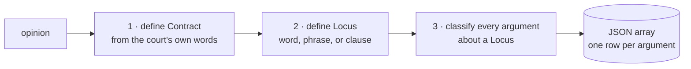
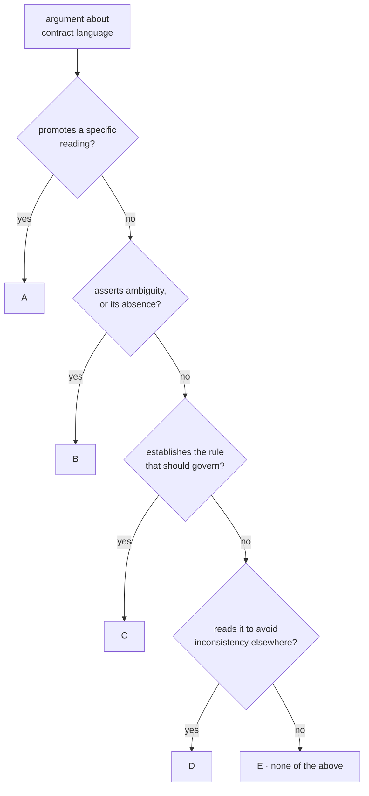
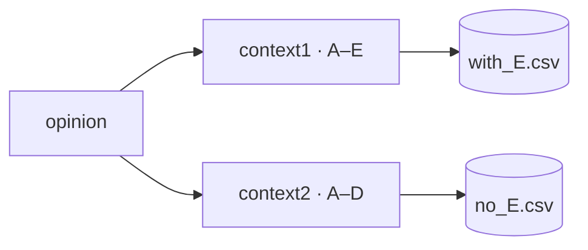
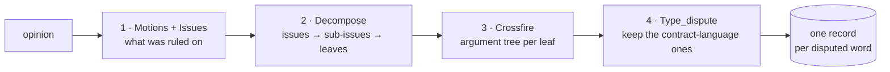
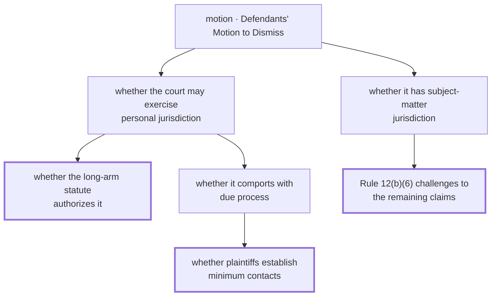
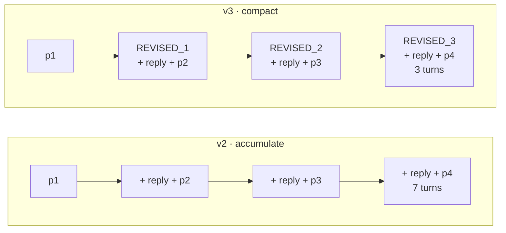
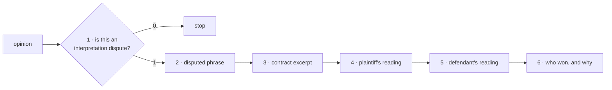
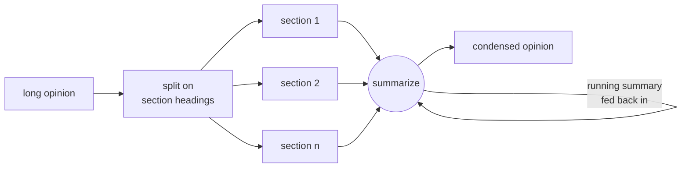
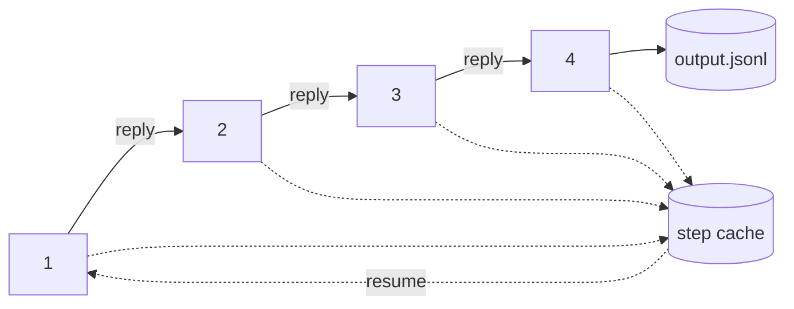
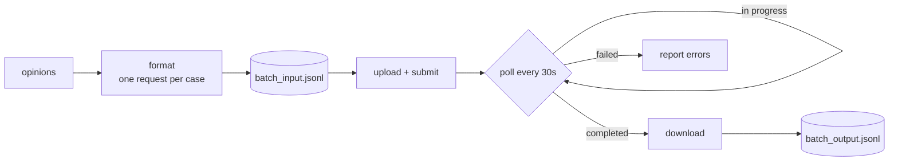

# Contract Interpretation Research

LLM pipelines for extracting **contract-interpretation arguments** from U.S. federal court
opinions. Given an opinion, the models identify the disputed contractual language (a *Locus*),
who argued about it (plaintiff / defendant / court), and what *type* of interpretive argument
was made, emitting structured JSON. The label set depends on the prompt version — see
[comparing runs across versions](#comparing-runs-across-versions).

## Contents

- [Repository layout](#repository-layout)
- [Setup](#setup)
- [Data](#data)
- [Running](#running)
- [How an opinion becomes structured JSON](#how-an-opinion-becomes-structured-json)
  - [`v1`: define the terms, then classify](#v1-define-the-terms-then-classify)
  - [`v2` `v3` `v4`: decompose the dispute](#v2-v3-v4-decompose-the-dispute)
    - [Step 1: the motions the court ruled on](#step-1-the-motions-the-court-ruled-on)
    - [Step 2: issues decompose into a forest](#step-2-issues-decompose-into-a-forest)
    - [Step 3: each leaf grows an argument tree](#step-3-each-leaf-grows-an-argument-tree)
    - [Step 4: pruning to contract-language disputes](#step-4-pruning-to-contract-language-disputes)
    - [How the three variants differ](#how-the-three-variants-differ)
  - [`qa_questions`: ask for the schema directly](#qa_questions-ask-for-the-schema-directly)
  - [`summarization`: fold a long opinion down](#summarization-fold-a-long-opinion-down)
  - [Comparing runs across versions](#comparing-runs-across-versions)
  - [How each prompt is delivered](#how-each-prompt-is-delivered)
  - [Why model and prompt version are flags, not files](#why-model-and-prompt-version-are-flags-not-files)
  - [Which prompt each pipeline runs](#which-prompt-each-pipeline-runs)

## Repository layout

```
prompts/                     # ALL prompt text, versioned. No prompt literals live outside here.
  v1_single_prompt.py        #   v1: whole task in one long prompt (context1, context2)
  v2_chained.py              #   v2: four chained steps, canonical wording (part_1..part_4)
  v3_chained_variant.py      #   v3: four steps reworded, + REVISED_STEP_* condensed restatements
  v4_flat_chained.py         #   v4: v2's steps flattened to one line each, for the Batch API
  qa_questions.py            #   Preamble + six fixed questions asked in sequence
  summarization.py           #   Hierarchical-summarization system/user messages
pipelines/                   # Runnable entry points, one per transport
  chained.py                 #   Four-step chain; --prompts v2|v3|v4, --model, --only-step
  single_prompt.py           #   v1: whole task in one call, run twice as an A-E ablation
  batch.py                   #   v4 via the Batch API: format requests, submit, collect
  interview.py               #   Six-question Gemini chat session per opinion
  summarize.py               #   Hierarchical summarization for opinions past the context window
lib/                         # Shared helpers, no entry points
  batch_api.py               #   Upload, poll, download a batch job
  chunking.py                #   Split an opinion on its numbered section headings
data/                        # Raw court opinions, one .txt per citation ("331 F.Supp.3d 263.txt")
dataset.py                   # Builds labels.csv from data/, and the single shared corpus loader
```

## Setup

```bash
python -m venv .venv && source .venv/bin/activate
pip install -r requirements.txt
cp .env.example .env      # then fill in your key
export OPENAI_API_KEY=...
```

All scripts read the key from `OPENAI_API_KEY`; none contain credentials.

## Data

`data/` holds the opinion texts, one `.txt` per citation. `labels.csv` is the manifest the
pipelines iterate over — it is gitignored, so build it from the corpus:

```bash
python -m dataset            # writes labels.csv from data/
```

| Column | Meaning |
|---|---|
| `citation` | Case identifier, e.g. `331 F.Supp.3d 263`; also the stem of the file in `data/` |
| `text` | The opinion text; may be left blank |
| `corrected_labels` | Human ground-truth label, filled in by hand |

Re-running `python -m dataset` picks up new opinions in `data/` and carries over any labels
you have already assigned (`--overwrite` discards them instead).

Every pipeline reads the manifest through `dataset.load_samples()`, which returns one
`{"citation", "text", "label"}` dict per case. Where a row's `text` cell is blank or truncated
(<= 100 chars) it falls back to `data/<citation>.txt`, so the CSV can carry just citations and
labels. A case with no usable text from either source is reported by citation and dropped
rather than sent to a model as an empty opinion.

## Running

Everything resolves paths from the repo root, so run pipelines as modules from the root:

```bash
python -m dataset                          # build labels.csv from data/ (once)

python -m pipelines.chained --prompts v2   # the four-step chain
python -m pipelines.single_prompt          # v1, one call per opinion
python -m pipelines.batch                  # v4 through the Batch API
python -m pipelines.interview              # six-question Gemini session
python -m pipelines.summarize              # summarize long opinions
```

Add `--help` to any of them for the available flags, and `--limit N` to `chained.py` to try
a few cases before committing to a full run.

## How an opinion becomes structured JSON

Four prompt families attack the same task with different decompositions. The prompt decides the
reasoning; the pipeline only decides how it is delivered. So the sections below are organised by
prompt, and each one opens with the steps that prompt actually asks for.

### `v1`: define the terms, then classify

Three instructions in a single prompt. It defines its vocabulary first — what counts as a
*Contract*, what counts as a *Locus* — and only then asks for arguments, so the classification
has something precise to bind to.



Step 3 is a decision tree. A through D are meant to be mutually exclusive, so an argument is
sorted into whichever one it fits; E catches whatever fits none of them:



`v1` ships as two variants, and `single_prompt.py` runs both over the corpus: `context1` as
drawn, `context2` with the E leaf deleted so every argument is forced into A–D. That is the
ablation — whether the escape hatch earns its place, or just absorbs arguments that belong in a
real category.



### `v2` `v3` `v4`: decompose the dispute

Four steps, each written as a function to evaluate over the previous step's result. Rather than
asking for arguments directly, they reconstruct the court's reasoning first and only look for
contract language at the very end.



Steps 2 and 3 are recursive, and what moves between them is a forest, not a list.

#### Step 1: the motions the court ruled on

The root of every tree. The model extracts each procedural action the court decides — the
action and the party that filed it, like *Defendants' Motion to Dismiss*. An opinion on a trial
rather than a motion yields the plaintiff's claims instead, and cross-motions for summary
judgment collapse to a single *Motion for Summary Judgment*.

#### Step 2: issues decompose into a forest

Each issue is broken down until it bottoms out. For every issue, the model asks what sub-issues,
burdens of proof, or legal standards the court says it is contingent on, and recurses. An issue
with no sub-issues is terminal and joins `leaves` — the frontier step 3 works on. One tree per
motion.



Thick borders are leaves. Everything above them is scaffolding the court had to work through to
get there.

#### Step 3: each leaf grows an argument tree

The sides alternate as it deepens. Each party's position sprouts two kinds of edge: `support`
(the same party backing its own claim) and `refutations` (the opponent attacking it). The
recursion follows both, and the party flips on every refutation — so depth is argumentative
depth, and the sides interleave.


#### Step 4: pruning to contract-language disputes

Of all those leaves, keep only the ones where the disagreement is about contract language, and
label each with which kind it is. Two further gates drop more: the disputed word must appear
word for word in the contract, and the court must have stated a stance. Everything else is
discarded silently.

#### How the three variants differ

Same four steps, three deliveries:

| | Wording | Conversation | Label |
|---|---|---|---|
| `v2` | canonical | accumulates — step 4 replays all seven turns | four requirement sentences |
| `v3` | reworded | restarts each step from a condensed restatement | letters A–D |
| `v4` | flattened to one line per step | none — all four sent at once | three requirement sentences |



### `qa_questions`: ask for the schema directly

Six fixed questions in one chat session, no decomposition at all. Question 1 is a gate; the rest
fill in the same fields the chain arrives at by building trees.



Each answer maps onto a step-4 field: Q2 to `disputed_word`, Q3 to `contract_excerpt`, Q4 to
`Plaintiff`, Q5 to `Defendant`, Q6 to `Court Opinion`. Q1 has no counterpart — it is the only
per-opinion yes/no in the repo, where the chain filters dispute by dispute instead.

Q2 carries the disambiguation rule the chain handles structurally: if the disputed term is
explicitly defined in the contract and the real argument is over a term *inside that
definition*, answer with the inner term only.

### `summarization`: fold a long opinion down

Not an extraction prompt — a preprocessor for opinions past the context window. Sections are
folded one at a time into a running summary, each call seeing the summary so far plus one new
section.



### Comparing runs across versions

The versions do not agree on the label set, and they do not agree on the record shape. Both bite
when comparing outputs:

| Version | Run by | Label |
|---|---|---|
| `v1` `context1` | `single_prompt.py` | Letters **A–E**, E carrying a free-text description |
| `v1` `context2` | `single_prompt.py` | Letters **A–D**, the E branch removed |
| `v2` | `chained.py --prompts v2` | No letters — the **full requirement sentence**, of four |
| `v3` | `chained.py --prompts v3` | Letters **A–D**, defined differently from `v1`'s |
| `v4` | `chained.py --prompts v4`, `batch.py` | No letters, and only **three** requirements — `v2`'s fourth, on two parts of a contract contradicting each other, is absent |

| | Record shape |
|---|---|
| `v1` | One row **per argument**, with `argument_position` naming who made it |
| `v2` `v3` `v4` | One record **per disputed word**, both sides already paired |

So `v1` gives unpaired arguments you would have to group by `disputed_word` yourself, and the
chain gives the pairing but only one dispute per word — a second dispute over the same word
overwrites the first, since `disputed_word` is the key.

### How each prompt is delivered

The pipelines are transport. `chained.py` caches every step by `(citation, model, step)`, so an
interrupted run resumes where it stopped and never pays for a step twice:



`batch.py` trades chaining for the lower batch rate — there is no reply to chain onto, so all
four steps go out in one request per opinion:



`single_prompt.py` and `interview.py` are plain loops over the corpus, one call and one session
per opinion respectively. `summarize.py` runs standalone over long opinions.

### Why model and prompt version are flags, not files

Three things vary across runs: the **prompt version**, the **model**, and the
**transport** (how many calls, and whether they chain). Only transport changes the
shape of the code, so only transport gets a file — prompt version and model are flags:

```bash
python -m pipelines.chained --prompts v2 --model o1-preview
python -m pipelines.chained --prompts v4 --model gpt-4-turbo
python -m pipelines.chained --prompts v2 --only-step 4     # reuse cached steps 1-3
```

`chained.py` caches every step by `(citation, model, step)` in its `--steps` file, so an
interrupted run resumes where it stopped and never pays for a step twice. Delete that file
to force a clean run.

The prompt version also selects how each step's messages are built. v2 and v4 accumulate one
growing conversation; v3 restarts at every step from a condensed restatement of what came
before (its `REVISED_STEP_*` prompts) to keep the context small. `chained.py` picks this up
from the prompt module rather than needing a flag.

### Which prompt each pipeline runs

| Prompt module | What it is | Run by |
|---|---|---|
| `v1_single_prompt` | The whole task in one prompt, in two variants: `context1` (A–E) and `context2` (A–D) | `python -m pipelines.single_prompt` |
| `v2_chained` | The four chained steps, canonical wording | `python -m pipelines.chained --prompts v2` |
| `v3_chained_variant` | The same four steps reworded, plus `REVISED_STEP_*` for the compact strategy | `python -m pipelines.chained --prompts v3` |
| `v4_flat_chained` | v2 flattened to one line per step | `python -m pipelines.chained --prompts v4`<br/>`python -m pipelines.batch` |
| `qa_questions` | Preamble and the six fixed questions | `python -m pipelines.interview` |
| `summarization` | System and user messages for recursive summarization | `python -m pipelines.summarize` |

`v4` is the only module with two callers: `chained.py` sends its steps as a conversation,
`batch.py` sends all four in one request. Everything else maps one-to-one.

Each pipeline imports the constants it sends:

```python
from prompts.v2_chained import part_1, part_2, part_3, part_4
```

So the import line records which wording a run used, and editing a prompt is a one-file diff
that shows exactly which pipelines it affects.
