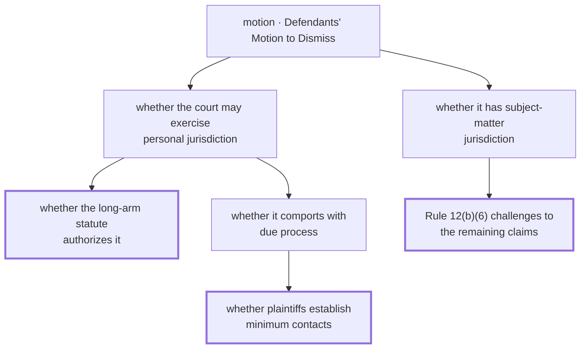
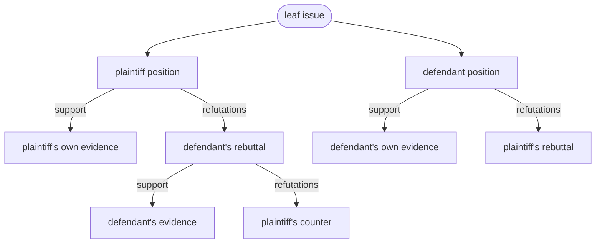
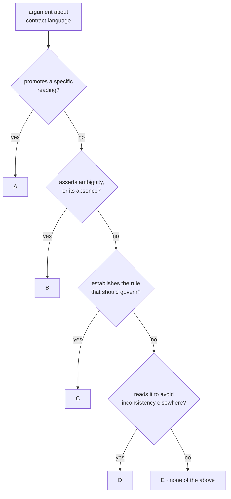
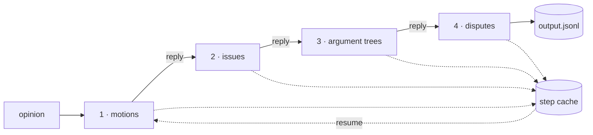
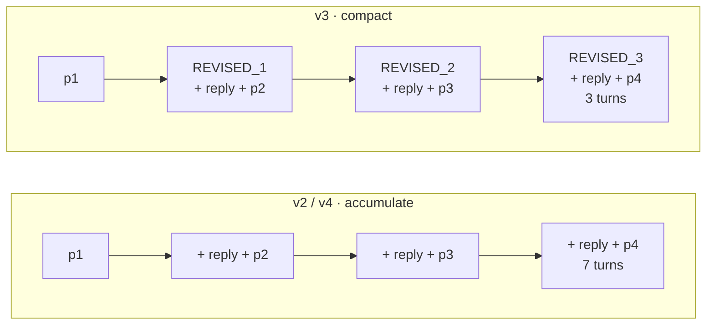
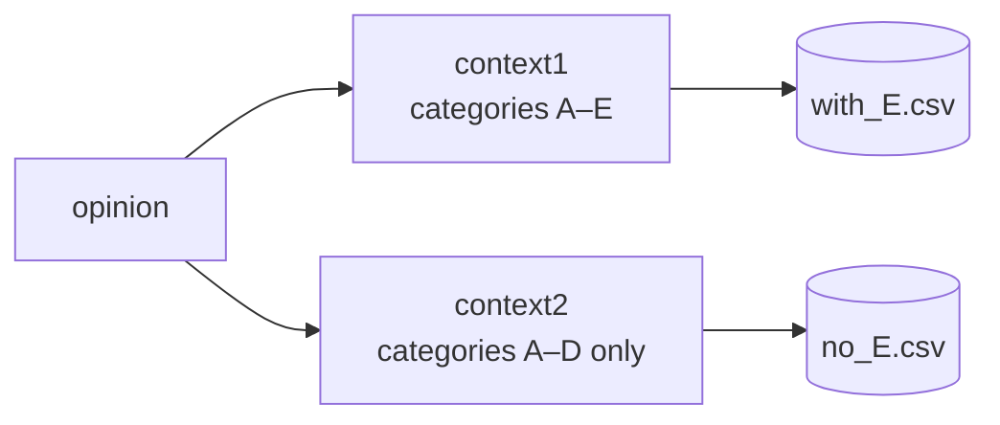
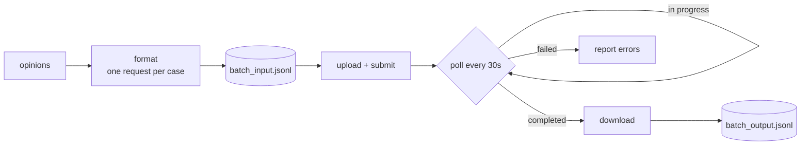
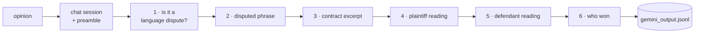
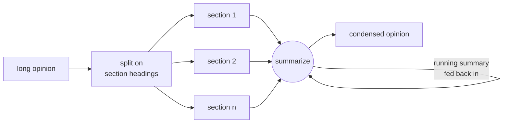

# Contract Interpretation Research

LLM pipelines for extracting **contract-interpretation arguments** from U.S. federal court
opinions. Given an opinion, the models identify the disputed contractual language (a *Locus*),
who argued about it (plaintiff / defendant / court), and what *type* of interpretive argument
was made (categories A–E), emitting structured JSON.

## Contents

- [Repository layout](#repository-layout)
- [Setup](#setup)
- [Data](#data)
- [Running](#running)
- [How an opinion becomes structured JSON](#how-an-opinion-becomes-structured-json)
  - [One prompt, or four chained steps](#one-prompt-or-four-chained-steps)
  - [From motion to labeled argument](#from-motion-to-labeled-argument)
  - [Each pipeline, end to end](#each-pipeline-end-to-end)
  - [Why model and prompt version are flags, not files](#why-model-and-prompt-version-are-flags-not-files)
  - [Which prompt each pipeline runs](#which-prompt-each-pipeline-runs)

## Repository layout

```
prompts/                     # ALL prompt text, versioned. No prompt literals live outside here.
  v1_single_prompt.py        #   v1: whole task in one long prompt (context1, context2)
  v2_chained.py              #   v2: four chained steps, canonical wording (part_1..part_4)
  v3_chained_variant.py      #   v3: four steps reworded, + REVISED_STEP_* condensed restatements
  v4_flat_chained.py         #   v4: v2's steps flattened to one line each, for the Batch API
  qa_questions.py            #   Preamble + six fixed questions asked in sequence
  summarization.py           #   Hierarchical-summarization system/user messages
pipelines/                   # Runnable entry points, one per transport
  chained.py                 #   Four-step chain; --prompts v2|v3|v4, --model, --only-step
  single_prompt.py           #   v1: whole task in one call, run twice as an A-E ablation
  batch.py                   #   v4 via the Batch API: format requests, submit, collect
  interview.py               #   Six-question Gemini chat session per opinion
  summarize.py               #   Hierarchical summarization for opinions past the context window
lib/                         # Shared helpers, no entry points
  batch_api.py               #   Upload, poll, download a batch job
  chunking.py                #   Split an opinion on its numbered section headings
data/                        # Raw court opinions, one .txt per citation ("331 F.Supp.3d 263.txt")
dataset.py                   # Builds labels.csv from data/, and the single shared corpus loader
```

## Setup

```bash
python -m venv .venv && source .venv/bin/activate
pip install -r requirements.txt
cp .env.example .env      # then fill in your key
export OPENAI_API_KEY=...
```

All scripts read the key from `OPENAI_API_KEY`; none contain credentials.

## Data

`data/` holds the opinion texts, one `.txt` per citation. `labels.csv` is the manifest the
pipelines iterate over — it is gitignored, so build it from the corpus:

```bash
python -m dataset            # writes labels.csv from data/
```

| Column | Meaning |
|---|---|
| `citation` | Case identifier, e.g. `331 F.Supp.3d 263`; also the stem of the file in `data/` |
| `text` | The opinion text; may be left blank |
| `corrected_labels` | Human ground-truth label, filled in by hand |

Re-running `python -m dataset` picks up new opinions in `data/` and carries over any labels
you have already assigned (`--overwrite` discards them instead).

Every pipeline reads the manifest through `dataset.load_samples()`, which returns one
`{"citation", "text", "label"}` dict per case. Where a row's `text` cell is blank or truncated
(<= 100 chars) it falls back to `data/<citation>.txt`, so the CSV can carry just citations and
labels. A case with no usable text from either source is reported by citation and dropped
rather than sent to a model as an empty opinion.

## Running

Everything resolves paths from the repo root, so run pipelines as modules from the root:

```bash
python -m dataset                          # build labels.csv from data/ (once)

python -m pipelines.chained --prompts v2   # the four-step chain
python -m pipelines.single_prompt          # v1, one call per opinion
python -m pipelines.batch                  # v4 through the Batch API
python -m pipelines.interview              # six-question Gemini session
python -m pipelines.summarize              # summarize long opinions
```

Add `--help` to any of them for the available flags, and `--limit N` to `chained.py` to try
a few cases before committing to a full run.

## How an opinion becomes structured JSON

### One prompt, or four chained steps

Two families of pipelines share the same task:

1. **Single prompt** (`pipelines/single_prompt.py`) — one long instruction defining Contract,
   Locus, and argument categories A–E; the model returns the full JSON array in one call. It
   runs each opinion twice, with and without category E (the "fits none of A–D" catch-all), as
   an ablation on whether that escape hatch helps.
2. **Chained steps** (`pipelines/chained.py`) — four prompts run in sequence, each consuming
   the previous output: extract the motions, derive the issues per motion, build the argument
   trees, then pick out the disputes that turn on contract language.

`pipelines/interview.py` drops the chain entirely and asks six fixed questions in one Gemini
chat session instead. `pipelines/summarize.py` handles opinions that exceed the context window
by chunking on numbered section headings and summarizing recursively before extraction.

### From motion to labeled argument

The chain is four steps, but what moves between them is a forest. Steps 2 and 3 are recursive:
they keep expanding until nothing is left to expand.

**Step 2 decomposes each issue until it bottoms out.** For every issue, the model asks what
sub-issues, burdens of proof, or legal standards the court says it is contingent on, and
recurses. An issue with no sub-issues is terminal and joins `leaves` — the frontier that step 3
works on. One tree per motion.



Thick borders are leaves. Everything above them is scaffolding the court had to work through
to get there.

**Step 3 grows an argument tree under each leaf, alternating sides.** Each party's position
sprouts two kinds of edge: `support` (the same party backing its own claim) and `refutations`
(the opponent attacking it). The recursion follows both, and the party flips on every
refutation — so depth is argumentative depth, and the sides interleave.



**Step 4 prunes.** Of all those leaves, it keeps only the ones where the disagreement is about
contract language — a reading of a phrase, whether a phrase is ambiguous, or what rule should
govern the reading. Everything else is discarded.

**The A–E labels are themselves a decision tree.** A through D are meant to be mutually
exclusive, so an argument is sorted into whichever one it fits; E catches whatever fits none of
them. Drawn as a cascade of tests:



`single_prompt.py` runs this tree twice per opinion: once as drawn, and once with the E leaf
deleted so every argument is forced into A–D. That is the ablation — whether the escape hatch
earns its place, or just absorbs arguments that belong in a real category.

### Each pipeline, end to end

**`chained.py`** — four prompts in sequence, each consuming the previous reply. Every step is
cached, so a re-run resumes rather than repeating work.



With `--prompts v2` or `v4` the conversation accumulates: step 4 replays all seven turns.
With `--prompts v3` each step restarts from a condensed restatement of the step before, so the
context stays at three turns no matter how deep the chain goes.



**`single_prompt.py`** — the whole task in one call, run twice over the corpus to test whether
the category-E catch-all helps or hurts.



**`batch.py`** — the same four prompts, but the Batch API has no reply to chain onto, so all
four go out in a single request per opinion at the lower batch rate.



**`interview.py`** — no chain at all. One Gemini chat session per opinion, six fixed questions
asked in order, each answered with the opinion and the earlier answers still in context.



**`summarize.py`** — for opinions past the context window: split on numbered section headings,
then fold each section into a running summary.



### Why model and prompt version are flags, not files

Three things vary across runs: the **prompt version**, the **model**, and the
**transport** (how many calls, and whether they chain). Only transport changes the
shape of the code, so only transport gets a file — prompt version and model are flags:

```bash
python -m pipelines.chained --prompts v2 --model o1-preview
python -m pipelines.chained --prompts v4 --model gpt-4-turbo
python -m pipelines.chained --prompts v2 --only-step 4     # reuse cached steps 1-3
```

`chained.py` caches every step by `(citation, model, step)` in its `--steps` file, so an
interrupted run resumes where it stopped and never pays for a step twice. Delete that file
to force a clean run.

The prompt version also selects how each step's messages are built. v2 and v4 accumulate one
growing conversation; v3 restarts at every step from a condensed restatement of what came
before (its `REVISED_STEP_*` prompts) to keep the context small. `chained.py` picks this up
from the prompt module rather than needing a flag.

### Which prompt each pipeline runs

| Prompt module | What it is | Run by |
|---|---|---|
| `v1_single_prompt` | The whole task in one prompt, in two variants: `context1` (A–E) and `context2` (A–D) | `python -m pipelines.single_prompt` |
| `v2_chained` | The four chained steps, canonical wording | `python -m pipelines.chained --prompts v2` |
| `v3_chained_variant` | The same four steps reworded, plus `REVISED_STEP_*` for the compact strategy | `python -m pipelines.chained --prompts v3` |
| `v4_flat_chained` | v2 flattened to one line per step | `python -m pipelines.chained --prompts v4`<br/>`python -m pipelines.batch` |
| `qa_questions` | Preamble and the six fixed questions | `python -m pipelines.interview` |
| `summarization` | System and user messages for recursive summarization | `python -m pipelines.summarize` |

`v4` is the only module with two callers: `chained.py` sends its steps as a conversation,
`batch.py` sends all four in one request. Everything else maps one-to-one.

Each pipeline imports the constants it sends:

```python
from prompts.v2_chained import part_1, part_2, part_3, part_4
```

So the import line records which wording a run used, and editing a prompt is a one-file diff
that shows exactly which pipelines it affects.
